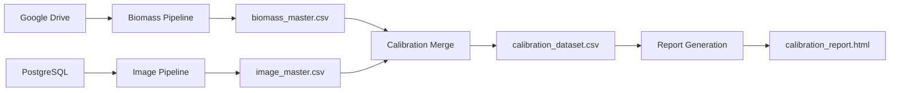

# Analytics Pipeline

A data pipeline for building biomass, image, and calibration datasets, and generating reports.
This project integrates data from **Google Drive** and **PostgreSQL**, standardizes it, and produces a merged dataset ready for analysis and reporting.

---

## 📌 What is this?

This pipeline is designed to:

- Ingest biomass data from Google Drive  
- Ingest image metadata from PostgreSQL  
- Clean and standardize datasets  
- Merge datasets into a calibration dataset  
- Generate reports  

💡 The pipeline is **fully configurable via YAML**, making it easy to reuse across datasets without modifying code.

---

## 🚀 Quick Start

Run the full pipeline:

```bash
python run_pipeline.py
```

Run individual steps:

```bash
# 1. Build biomass dataset (from Google Drive)
python scripts/build_biomass_master.py

# 2. Build image dataset (from PostgreSQL)
python scripts/build_image_master.py

# 3. Build calibration dataset
python scripts/build_calibration_dataset.py

# 4. Generate report
python scripts/build_calibration_report.py
```

---

## 🔄 Pipeline Overview

The pipeline consists of four stages:

1. **Biomass ingestion**

   * Source: Google Drive
   * Output: `data/processed/biomass_master.csv`

2. **Image ingestion**

   * Source: PostgreSQL
   * Output: `data/processed/image_master.csv`

3. **Dataset merge**

   * Combines biomass + image datasets
   * Output: `data/processed/calibration_dataset.csv`

4. **Report generation**

   * Output: `reports/calibration_report.html`

---

## 📊 Data Flow Diagram



> ⚠️ If the diagram does not render in VS Code, install a Markdown Mermaid extension.

---

## ⚡ Data Caching Behavior

- Data is cached locally after first fetch
- Cache is considered valid for 24 hours
- Data will be re-fetched if:
  - cache is older than 24 hours
  - `--refresh` flag is used

To force fresh data:

```bash
python scripts/build_biomass_master.py --refresh
python scripts/build_image_master.py --refresh
```
---

## ⚙️ Configuration (YAML-driven)

All pipeline behavior is controlled via YAML files:

```
config/
  biomass.yaml
  image.yaml
  calibration.yaml
```
---

## 🔐 Environment Setup

### 1. Create Python environment (Conda)

```bash
conda create -n analytics-pipeline python=3.10
conda activate analytics-pipeline

# Install project and dependencies
pip install -e .
```
### 2. Create a `.env` file in the project root

This project relies on environment variables for external services.

```env
# ----------------------------
# Google Drive
# ----------------------------
GOOGLE_CREDENTIALS_PATH=path/to/credentials.json
GOOGLE_TOKEN_PATH=path/to/token.json
GOOGLE_DRIVE_BIOMASS_2024_FOLDER_ID=your_folder_id
GOOGLE_DRIVE_BIOMASS_2025_FOLDER_ID=your_folder_id

# ----------------------------
# PostgreSQL
# ----------------------------
DB_USER=your_user
DB_PASS=your_password
DB_HOST=your_host
DB_PORT=5432
DB_NAME=your_database

# ----------------------------
# Confluence (optional)
# ----------------------------
CONFLUENCE_URL=https://your-domain.atlassian.net
CONFLUENCE_USERNAME=your_email
CONFLUENCE_API_TOKEN=your_token

# ----------------------------
# Environment
# ----------------------------
ENV=development
```

---

## 📦 Pipeline Steps

### 🌿 Biomass Dataset

```bash
python scripts/build_biomass_master.py [--refresh]
```

* Downloads biomass CSVs from Google Drive
* Cleans and standardizes data using `biomass.yaml`

**Output:**
`data/processed/biomass_master.csv`

---

### 🖼️ Image Dataset

```bash
python scripts/build_image_master.py [--refresh]
```

* Queries image data from PostgreSQL
* Filters and cleans records using `image.yaml`

**Output:**
`data/processed/image_master.csv`

---

### 🔗 Calibration Dataset

```bash
python scripts/build_calibration_dataset.py [--diagnostics]
```

- Merges datasets using keys defined in `calibration.yaml`  
- Outputs merged dataset  

**Output:**
`data/processed/calibration_dataset.csv`

**Diagnostics (optional):**
`data/processed/diagnostics/`

---

### 📊 Report Generation

```bash
python scripts/build_calibration_report.py
```

**Output:**
`reports/calibration_report.html`

---

## 📂 Project Structure

```
config/                 # YAML configuration files

data/
  raw/                  # Raw input data
  processed/            # Generated datasets
  logs/                 # Logs

scripts/                # CLI entry points (pipeline steps)

src/analytics_pipeline/
  config/               # Env loading, logging, validation
  google_drive/         # Drive integration
  postgres/             # Database integration
  processing/           # Core pipeline logic

reports/                # Output reports
```

---

## ⚠️ Important Notes

* Requires access to:

  * Google Drive (biomass data)
  * PostgreSQL database (image data)

* Column names must match across datasets for merging

* Cached data is reused unless `--refresh` is specified

* Output folders are created automatically if missing

---

## 🧠 Troubleshooting

If merge results look incorrect, rerun with diagnostics:

```bash
python scripts/build_calibration_dataset.py --diagnostics
```

This will generate diagnostic files to inspect mismatches.

---

## 🚀 Future Improvements

- Push filtering to database queries (performance optimization)  
- The build_calibration_report.py script is still a work in progress
---