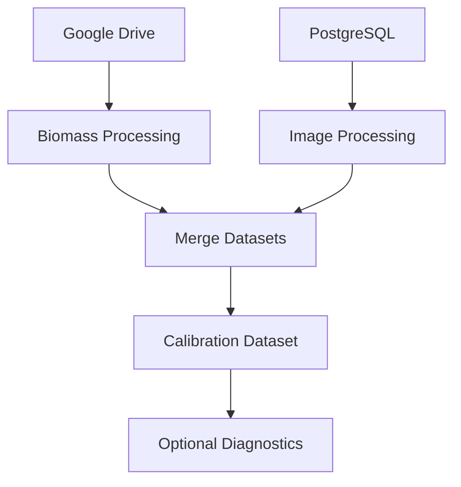
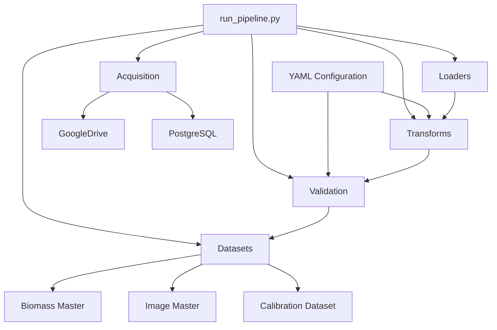

# PM3D Analytics Pipeline

A configurable Python pipeline for building training datasets that link **field measurements** with **PlantMap3D image data and metadata**.

The pipeline downloads biomass spreadsheets from Google Drive, retrieves image metadata from PostgreSQL, standardizes both datasets through protocol-specific YAML configurations, and produces model-ready training datasets for downstream machine learning and analysis.

The project is designed so that **adding a new protocol typically requires only a new configuration file**, rather than modifying the processing code.

---

# Quick Start

Clone the repository

```bash
git clone <repository-url>
cd pm3d-training-data-compiler
```

Install the project

```bash
pip install -e ".[dev]"
```

Create a `.env` file (see the Environment Variables section below).

Run the full pipeline

```bash
python run_pipeline.py all --protocol b4i
```

---

# Data Flow

The pipeline combines two independent data sources into a single training dataset.



---

# Pipeline Architecture

The project is organized into small, reusable modules. Acquisition, loading, transformation, validation, and dataset assembly are intentionally separated so that protocol-specific behavior is driven by configuration rather than embedded throughout the codebase.




---

# Project Structure

```text
pm3d-training-data-compiler/
│
├── config/
│   ├── pipeline.yaml
│   ├── b4i.yaml
│   └── calib_cover_crops.yaml
│
├── data/
│   ├── raw/
│   ├── processed/
│   └── logs/
│
├── scripts/
│   ├── build_biomass_master.py
│   ├── build_image_master.py
│   ├── build_calibration_dataset.py
│   └── build_calibration_report.py      # Work in progress
│
├── src/
│   └── analytics_pipeline/
│       ├── config/
│       ├── google_drive/
│       │   ├── auth.py
│       │   ├── client.py
│       │   └── manager.py
│       │
│       ├── postgres/
│       │   ├── client.py
│       │   ├── datasets.py
│       │   └── engine.py
│       │
│       ├── processing/
│       │   ├── acquisition/
│       │   ├── adapters/
│       │   ├── datasets/
│       │   ├── loaders/
│       │   ├── schema/
│       │   │   ├── biomass_schema.py
│       │   │   └── validate.py
│       │   └── transforms/
│       │
│       ├── config/
│       └── paths.py
│
├── tests/
│
├── run_pipeline.py
├── pyproject.toml
└── README.md
```

---

# Features

- Download biomass spreadsheets from Google Drive
- Retrieve image metadata from PostgreSQL
- Configurable protocol-specific processing
- Automatic cache management
- Standardized training datasets
- Optional reconciliation diagnostics
- Unit tests with `pytest`
- Automatic code formatting with `black`
- Static analysis with `ruff`

---

# Requirements

- Python 3.10+
- PostgreSQL database access
- Google Drive API credentials
- Access to the required PM3D Google Drive folders

---

# Installation

Clone the repository

```bash
git clone <repository-url>
cd pm3d-training-data-compiler
```

Install the project

```bash
pip install -e .
```

Install development tools

```bash
pip install -e ".[dev]"
```

---

# Environment Variables

Create a `.env` file in the project root.

Example:

```text
GOOGLE_CREDENTIALS_PATH=credentials/google_credentials.json
GOOGLE_TOKEN_PATH=credentials/google_token.json

DB_USER=my_username
DB_PASS=my_password
DB_HOST=my_database_host
DB_PORT=5432
DB_NAME=my_database
```

---

# Google Authentication

The first execution will open a browser window requesting authorization to access Google Drive.

After authentication, a token is stored locally and automatically reused in future executions.

---

# Configuration

Pipeline behavior is controlled through the YAML files inside the `config/` directory.

```text
config/
    pipeline.yaml
    b4i.yaml
    calib_cover_crops.yaml
```

These files define:

- field data years
- image filters
- column mappings
- plot ID generation
- merge keys
- output configuration

Most new protocols can be supported by creating a new YAML configuration file without changing the processing code.

---

# Running the Pipeline

Run the complete pipeline

```bash
python run_pipeline.py all --protocol b4i
```

Build only the biomass dataset

```bash
python run_pipeline.py biomass --protocol b4i
```

Build only the image dataset

```bash
python run_pipeline.py image
```

Build the training dataset

```bash
python run_pipeline.py calibration --protocol b4i
```

Force a fresh download

```bash
python run_pipeline.py all --protocol b4i --refresh
```

Generate reconciliation diagnostics

```bash
python run_pipeline.py calibration --protocol b4i --diagnostics
```

---

# Outputs

The pipeline creates the following structure:

```text
data/
├── raw/
│
├── processed/
│   └── <PROTOCOL>/
│       ├── biomass_master.csv
│       ├── image_master.csv
│       ├── calibration_dataset.csv
│       └── diagnostics/
│
└── logs/
```

Diagnostic outputs include:

- calibration reconciliation
- mismatch summary
- coverage by affiliation
- coverage by year and affiliation

---

# Running Tests

Run the complete test suite

```bash
pytest
```

Run an individual test

```bash
pytest tests/test_plot_id.py
```

---

# Code Quality

Format the project

```bash
black .
```

Run static analysis

```bash
ruff check .
```

---

# Adding a New Protocol

Adding support for a new protocol typically consists of:

1. Creating a new protocol YAML file.
2. Defining biomass years.
3. Configuring column mappings.
4. Configuring plot ID generation.
5. Configuring image filters.
6. Running the pipeline.

For most protocols, no changes to the processing code are required.

---

# Future Work

Planned improvements include:

- HTML calibration report generation (`build_calibration_report.py`)
- Additional protocol adapters
- End-to-end integration tests

---

# Development Tools

This project uses:

- pandas
- SQLAlchemy
- Google Drive API
- pytest
- black
- ruff

---

# License

Internal project developed for the PlantMap3D analytics pipeline.